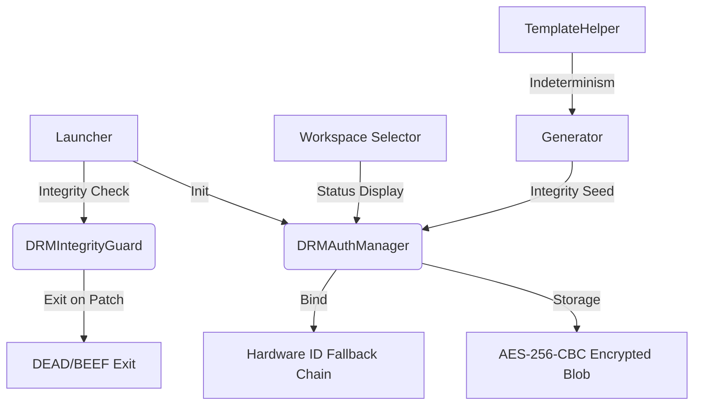

# DRM & Security Specification (Hardened v2.0)

This document provides a comprehensive technical overview of the DRM (Digital Rights Management) and Security system, following the 2024 hardening initiative.

---

## 1. System Architecture
The security system is distributed across the codebase to prevent localized bypasses. It operates on an "Echelon Defense" principle:



---

## 2. Cryptographic Foundation

### 2.1 Encryption Standard
- **Algorithm**: `AES/CBC/PKCS5Padding`
- **Key Length**: 256-bit
- **Implementation Vector (IV)**: Random 16-byte IV generated per-save, stored as a prefix in the binary data.
- **Key Derivation (KDF)**: `PBKDF2WithHmacSHA256`
    - **Iterations**: 65,536
    - **Salt**: `Base64("TUNyZWF0b3I=")`
    - **Entropy**: Combined HWID + Obfuscated Static HMAC Secret.

### 2.2 Storage Specification
- **File**: `~/.mcreator/drm_auth.bin`
- **Format**: `[IV (16 bytes)] + [Encrypted Payload (Ciphertext)]`
- **Payload Schema**:
  ```json
  {
    "token": "...",
    "refresh": "...",
    "login": "...",
    "authExpire": "ISO-8601",
    "refreshExpire": "ISO-8601",
    "lastCheckedTime": "ISO-8601"
  }
  ```

---

## 3. Hardware Identification (HWID)
To ensure reliable cross-platform binding that survives OS updates and custom builds:

### 3.1 OS-Specific Identification
| Platform | Primary Command/Source | Fallback Logic |
| :--- | :--- | :--- |
| **Windows** | `wmic csproduct get uuid` | Registry `MachineGuid` → `vol c:` (Volume Serial) |
| **macOS** | `ioreg -rd1 -c IOPlatformExpertDevice` | Parses `"IOPlatformUUID"` attribute |
| **Linux** | `/etc/machine-id` | `dbus-uuidgen --get` |

### 3.2 Global Components
All platforms contribute the following to the HWID entropy pool:
- **Processor Architecture** (`os.arch`)
- **Logical CPU cores** (`availableProcessors`)
- **Active MAC Addresses**: Aggregated from all non-virtual, non-loopback, active UP network interfaces.

---

## 4. Integrity & Anti-Tamper Measures

### 4.1 Bytecode Integrity Guard (`DRMIntegrityGuard`)
Running at the very beginning of `MCreatorApplication`, it performs three checks:
1.  **Reflection Check**: Verifies method names, access modifiers (`public static synchronized`), and class existence.
2.  **Binary Checksum**: Calculates **CRC32** of the `DRMAuthManager.class` bytecode using `getResourceAsStream`.
    > [!IMPORTANT]
    > **Environment Awareness**: The binary checksum is automatically skipped when running in an IDE (`file://` protocol) to prevent blocking development.
3.  **Integrity Seed Check**: Ensures the seed isn't zeroed out by a patcher.

### 4.2 Generator Anti-Excision
The `TemplateHelper` uses a DRM-derived `integritySeed` to influence its `random()` methods.
- **Seed Source**: If DRM is valid, seed = hash(token). If invalid, seed = constant/null.
- **Result**: Code generated in "cracked" versions will have mismatched internal variable names, IDs, and deterministic formatting, leading to build errors and 프로젝트 corruption.

---

## 5. Network Security & API

### 5.1 Protocol
- **Endpoint**: `https://api.funcode.school/api/auth`
- **Network Stack**: `HttpsURLConnection` with system-level CA validation.
- **Anti-Sniffing**: Sensitive payloads (credentials) are transmitted via POST over TLS 1.2+.

### 5.2 API Schema
#### `POST /login`
**Request**: `{ "login": "...", "password": "...", "role": "student" }`
**Success (200)**: returns JWT token, refresh token, and ISO durations.

---

## 6. Deep Root Enforcement (Multilayered Chain)
- **Synchronous Hard Gate**: The application initialization is blocked at the `Launcher` level. No UI or background services start until `DRMAuthManager.validateOrCrash()` succeeds.
- **Fail-Closed "Poison Seed"**: The `DRMAuthManager.getIntegritySeed()` returns a value derived from the active session token. This seed is injected into critical logic (e.g., `TemplateHelper.random`).
    - If the login is bypassed, the seed is `0`.
    - `0` seed causes deterministic corruption of all generated code logic, rendering the software useless for actual development even if the UI is bypassed.
- **Runtime Integrity Guard**: Reflexive checks verify that DRM methods haven't been removed or modified via bytecode manipulation.

---

## 7. Security & Robustness
- **Input Sanitization**: Login fields use `DocumentFilter` to prevent spaces, restrict characters (alphanumeric for login), and enforce strict length limits (64 for login, 128 for password) to prevent buffer overflow or injection attempts.
- **HWID Binding**: Encryption keys are local to the machine, preventing session file portability.

---

## 8. Troubleshooting
- **Error 0xDEAD**: Critical DRM method missing or renamed (Reflection failure).
- **Error 0xBEEF**: Bytecode checksum mismatch or general security violation.
- **Log Noise**: `javax.crypto.BadPaddingException` is handled silently when it originates from a HWID mismatch (expected after hardware changes).

