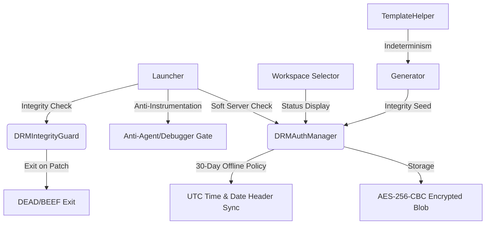

# DRM & Security Specification (Hardened v2026.1)

This document provides a comprehensive technical overview of the DRM (Digital Rights Management) and Security system, specifically the 2026 AI-Resistant Hardening updates.

---

## 1. System Architecture
The security system is distributed across the codebase to prevent localized bypasses. It operates on an "Echelon Defense" principle:



---

## 2. Session Lifecycle & Lifespan
The system enforces two distinct temporal limits to balance user convenience with security.

| Policy | Duration | Mechanism | Purpose |
| :--- | :--- | :--- | :--- |
| **Offline Window** | 30 Days | Sliding window based on `refreshExpire` | Allows prolonged offline usage. Reset upon every successful online sync. |
| **Hard Session Cap** | 90 Days | Fixed limit from `sessionStartTime` | Forces full re-authentication (login/password) to prevent permanent session hijacking. |

### 2.1 Sliding 30-Day Window (Refresh)
Each time the application successfully connects to the server and refreshes its token, the 30-day offline window is reset. This ensures that active users rarely encounter lockouts as long as they connect at least once a month.

### 2.2 Global 90-Day Cap (Hard Login)
Regardless of refreshes, the session is invalidated 90 days after the initial login. The user must provide credentials again to establish a new 90-day session anchor.

---

## 4. Cryptographic Foundation

### 4.1 Encryption Standard
- **Algorithm**: `AES/CBC/PKCS5Padding`
- **Key Length**: 256-bit
- **Implementation Vector (IV)**: Random 16-byte IV generated per-save, stored as a prefix in the binary data.
- **Key Derivation (KDF)**: `PBKDF2WithHmacSHA256`
    - **Iterations**: 65,536
    - **Salt**: `Base64("TUNyZWF0b3I=")` (to be replaced by XOR secret)
    - **Entropy**: Combined HWID + Obfuscated Static HMAC Secret.

### 4.2 Storage Specification
- **File**: `~/.mcreator/drm_auth.bin`
- **Format**: `[IV (16 bytes)] + [Encrypted Payload (Ciphertext)]`
- **Payload Schema**:
  ```json
  {
    "token": "...",
    "refresh": "...",
    "login": "...",
    "authExpire": "ISO-8601",
    "refreshExpire": "ISO-8601",
    "lastCheckedTime": "ISO-8601",
    "sessionStartTime": "ISO-8601"
  }
  ```

---

## 5. Hardware Identification (HWID)
To ensure reliable cross-platform binding that survives OS updates and custom builds:

### 5.1 OS-Specific Identification
| Platform | Primary Command/Source | Fallback Logic |
| :--- | :--- | :--- |
| **Windows** | `wmic csproduct get uuid` | Registry `MachineGuid` → `vol c:` (Volume Serial) |
| **macOS** | `ioreg -rd1 -c IOPlatformExpertDevice` | Parses `"IOPlatformUUID"` attribute |
| **Linux** | `/etc/machine-id` | `dbus-uuidgen --get` |

### 5.2 Global Components (Stable Architecture)
The HWID is generated using high-entropy, immutable hardware identifiers to ensure consistency across network state changes (VPN, Offline, Interface toggling):
1.  **System UUID**: Retrieved via `wmic csproduct get uuid` (Windows), `ioreg` (macOS), or `/etc/machine-id` (Linux).
2.  **OS Guard**: Utilizes the `MachineGuid` from the Windows Registry as a stable secondary anchor.
3.  **CPU signature**: Combines `os.arch` and `availableProcessors` to fingerprint the execution environment.
4.  **Derivation**: All components are hashed using **PBKDF2WithHmacSHA256** with a unique salt to generate the final AES-256 decryption key.

---

## 6. Integrity & Anti-Tamper Measures

### 6.1 Anti-Instrumentation
The very first logic in `Launcher.main()` scans the JVM input arguments for unauthorized instrumentation tools:
- **Blocked**: `-javaagent` (except OTel), `-Xdebug`, `jdwp`, `frida`, `bytebuddy`, `asmdex`, `instrumentation`.
- **Exemptions**: `opentelemetry` is permitted to allow development and Sentry integration.
- **Action**: Immediate `System.exit(0)` without UI if a blocked agent is detected.

### 7.2 Bytecode Integrity Guard (`DRMIntegrityGuard`)
Run after the Launcher gate, it performs:
1.  **Reflection Check**: Verifies critical method signatures in `DRMAuthManager`.
2.  **Binary Checksum**: Calculates **SHA-256** hash of critical DRM classes (Skipped in IDE mode).

---

## 7. Time Synchronization & Guarding

### 7.1 30-Day Offline Support
The system allows full functionality without internet for up to 30 days. 
- Validation is performed against the `refreshExpire` timestamp stored in the encrypted session.
- System time is tracked using **UTC** to avoid timezone/DST issues.
- To prevent clock rollback, `lastCheckedTime` is continuously updated. If the current system time is ever significantly *earlier* than this value, "Time Tampering" is triggered.
- During every **Soft Server Check**, the application extracts the `Date` header from the server response. This trusted UTC time is used to update `lastCheckedTime`, bypassing the local system clock.

---

## 8. Server-Side Verification

### 8.1 Soft Server Check & Silent Refresh
At startup, `DRMAuthManager.validateOrCrash()` attempts to verify the token with the server.
- **Throttling**: The check is performed once every **2 hours**.
- **Offline Fallback**: If the server is unreachable, the application continues via local validation (see Section 2).
- **Silent Refresh**: If the access token is expired (401), the application silently calls `/api/auth/refresh` to extend the 30-day offline window.

### 8.2 Checked Endpoint
The check uses the `/api/reward/balance` endpoint to verify the bearer token and retrieve the server date header.

---

## 9. Deep Root Enforcement (Generator Integrity Seed)
To prevent DRM excision by simply bypassing `validateOrCrash()`, the code generator incorporates a **64-bit Integrity Seed**.

- **Derivation**: The seed is computed as `HMAC-SHA256(JWT_TOKEN, OBFS_SECRET)`.
- **Entropy**: The first 64 bits of the HMAC hash are used to form a `long` value.
- **Enforcement**: 
    - **Valid Session**: Returns a unique, cryptographically derived seed.
    - **Invalid/Tampered**: Returns `0` (Poison State).
- **Generator Binding**: The seed influences the random generation of internal identifiers and variable names. If a "cracked" version forces a `0` seed, the generated project logic becomes subtly corrupted.

---

## 10. Troubleshooting
- **Error 0xDEAD**: Reflection failure (Method renamed or missing).
- **Error 0xBEEF**: Bytecode mismatch (Class modified).
- **Unsupported Environment**: Java Agent or Debugger detected.
- **Time Tampering**: Detected system clock rollback compared to `lastCheckedTime`.
